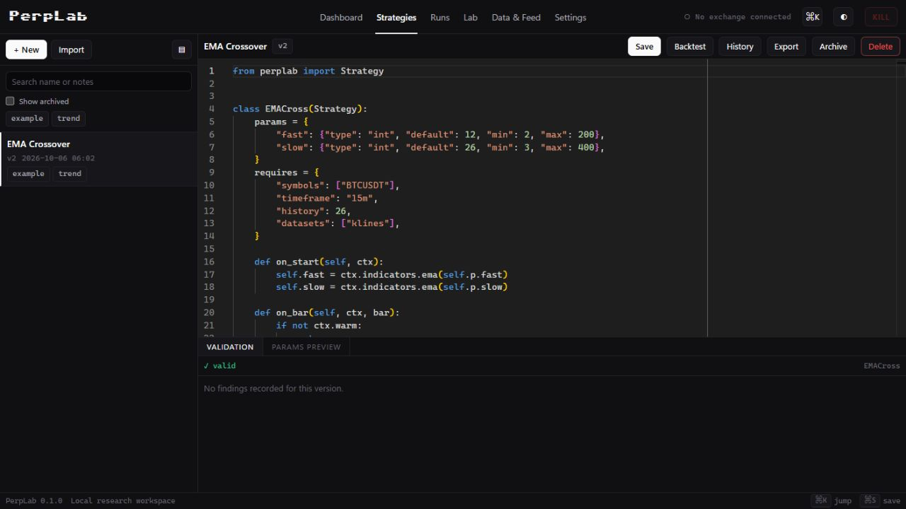

# PerpLab

**A local research workspace for perpetual futures.**

Write a strategy in Python. Replay it against market data. Examine the fills,
funding, and drawdowns. Test how well it holds up outside the period that made it
look good.

PerpLab brings that workflow into one browser application for **Binance USDⓈ-M
perpetual futures**. The editor, backtest engine, research Lab, and paper-session
monitor share a strategy API and a local data store. Your code, market recordings,
and run history stay on your machine.

[](https://github.com/anshul-vijay-chinchole/Perplab/actions/workflows/ci.yml)


[Get started](#quick-start) · [Strategy guide](docs/STRATEGY_GUIDE.md) · [Documentation](docs/README.md) · [Contribute](CONTRIBUTING.md)



## From an idea to a result you can inspect

| Workspace | What you can do |
| --- | --- |
| **Strategies** | Write Python in the Monaco editor, declare parameters, validate code, and keep immutable versions. |
| **Runs** | Backtest strategies and inspect equity, drawdown, trades, execution events, fees, and funding. |
| **Lab** | Run parameter sweeps, walk-forward analysis, Monte Carlo simulations, regime breakdowns, overfitting diagnostics, and portfolio comparisons. |
| **Data & Feed** | Backfill market archives, record live feeds, and inspect coverage, gaps, and freshness. |
| **Dashboard** | See recent research, session state, and the controls needed to start the next run. |
| **Settings** | Configure execution defaults, risk limits, exchange connections, and memory budgets. |

Paper sessions record a replayable tape. A shadow backtest replays that tape and
compares its results with the session, making execution differences visible.

## What matters in a futures backtest

**Execution depends on the data you actually have.** PerpLab supports four fill
tiers, from bar-close simulation to order-book depth walking. The engine derives
the available tier from local coverage and reports a downgrade in the run metadata
and results screen.

| Fill tier | Execution evidence |
| --- | --- |
| `BAR_CLOSE` | Bar prices; useful for indicative research. |
| `TRADE_ONLY` | Aggregate trade prints. |
| `BOOK_TICKER` | Trade prints and the best bid/ask. |
| `BOOK_WALK` | Recorded depth snapshots for book walking. |

**Perpetuals need more than price returns.** The accounting engine models maker
and taker fees, funding settlements, leverage brackets, margin, and liquidation.
It supports isolated and cross margin, plus one-way and hedge position modes.

**A result carries its assumptions.** Runs record the strategy version,
configuration, data fingerprint, engine version, and event-log hash. Deterministic
replay and look-ahead checks are part of the test suite.

**Risk controls belong in the engine.** Exposure limits, drawdown and loss limits,
order rejection triggers, and a persistent kill switch operate alongside execution.
Worker budgets and memory-aware admission keep research jobs within configured
resource limits.

## Quick start

The full platform currently requires **Windows**, **Python 3.11+**, **Node.js 22+**,
and Git. The resource governor uses Windows Job Objects to enforce memory limits.

From PowerShell:

```powershell
git clone https://github.com/anshul-vijay-chinchole/Perplab.git
cd Perplab

py -3 -m venv .venv
.venv\Scripts\python.exe -m pip install -e ".[api]"

npm --prefix frontend ci
npm --prefix frontend run build

.venv\Scripts\python.exe -m perplab serve
```

Open **[127.0.0.1:8756](http://127.0.0.1:8756)**. The backend serves both the API
and the built interface. Interactive API documentation is at
[`/api/docs`](http://127.0.0.1:8756/api/docs).

For a desktop shortcut:

```powershell
powershell -ExecutionPolicy Bypass -File scripts/launcher/install_shortcut.ps1
```

The launcher starts the local server, waits for it to become ready, and opens the
platform. Server logs are written to `userdata/logs/`.

### Your first research session

1. Open **Strategies** and create a strategy. The starter template includes an EMA
   crossover, a data declaration, and configurable periods.
2. Save and validate it. PerpLab checks the strategy in a separate process.
3. Use **Data & Feed** to inspect and acquire the data for your symbols and dates.
4. Start a backtest, review its fill tier and risk settings, then inspect the results.
5. Send the completed run to **Lab** to explore sensitivity and out-of-sample behavior.

A fresh clone contains no market history. Public-data collection and bulk backfills
do not require exchange credentials; account sessions require an exchange connection.
Read the [ingestion guide](docs/INGESTION.md) before downloading large tick archives.

### Record and backfill data

Start the market recorder in a separate terminal:

```powershell
.venv\Scripts\python.exe -m perplab collect --symbol BTCUSDT --supervise
```

Preview a small backfill before downloading it:

```powershell
.venv\Scripts\python.exe -m perplab ingest --dry-run --symbol BTCUSDT --dataset klines --start 2024-03-01 --end 2024-03-07
```

The dry run reads local receipts and estimates the work. Remove `--dry-run` to
download. Historical depth and quote coverage varies by dataset; use the coverage
screen and [availability notes](docs/DATA_AVAILABILITY.md) when choosing a fill tier.

## A strategy is a Python class

Declare the data you need, register indicators at startup, and act on completed bars.
This example illustrates the API; it is not a trading recommendation.

```python
from perplab import Strategy


class EMACross(Strategy):
    params = {
        "fast": {"type": "int", "default": 12, "min": 2, "max": 200},
        "slow": {"type": "int", "default": 26, "min": 3, "max": 400},
    }
    requires = {
        "symbols": ["BTCUSDT"],
        "timeframe": "15m",
        "history": 26,
        "datasets": ["klines"],
    }

    def on_start(self, ctx):
        self.fast = ctx.indicators.ema(self.p.fast)
        self.slow = ctx.indicators.ema(self.p.slow)

    def on_bar(self, ctx, bar):
        if not ctx.warm:
            return
        position = ctx.position()
        if self.fast.crossed_above(self.slow) and position.is_flat:
            ctx.buy(qty=ctx.risk.size_by_notional(ctx.account.equity / 10))
        elif self.fast.crossed_below(self.slow) and position.is_long:
            ctx.close()
```

The [strategy guide](docs/STRATEGY_GUIDE.md) covers protective orders, sizing,
tick strategies, multi-symbol strategies, and the complete context API.

## Architecture

**Python + FastAPI** serves the application and schedules isolated workers.
**React + TypeScript + Monaco** provides the research interface. **Parquet,
DuckDB, Polars, and PyArrow** handle market data; **SQLite** stores strategies,
versions, and job records.

```text
frontend/           Browser interface and strategy editor
perplab/
  api/              Local API and job orchestration
  core/             Accounting, margin, funding, and risk
  data/             Collection, ingestion, queries, and coverage
  engine/           Event replay and fill simulation
  strategy/         Strategy API, indicators, validation, and library
  lab/              Research and robustness analysis
  live/             Sessions, exchange transport, and shadow replay
  analytics/        Metrics, trade analysis, and attribution
  store/            Persistent strategies and job records
tests/              Unit, integration, golden, and property tests
docs/               Guides, technical references, and historical notes
userdata/           Local data and results; excluded from Git
```

## Scope and current limits

PerpLab targets a single operator and Binance USDⓈ-M perpetuals. The repository
includes backtesting, research tools, paper/testnet sessions, and a live execution
path. **Real-account live trading has not completed production sign-off.**
Long-duration collector and paper-session criteria are documented separately from
automated tests in the [verification history](docs/PHASE_SIGNOFF.md).

Fill quality depends on coverage. Queue position is approximated, and depth history
depends on recordings. A test suite cannot establish profitability or guarantee
venue behavior. The [data notes](docs/DATA_AVAILABILITY.md),
[accounting notes](docs/ACCOUNTING_NOTES.md), and
[resource policy](docs/RESOURCE_POLICY.md) explain the practical boundaries.

## Development

```powershell
.venv\Scripts\python.exe -m pip install -e ".[dev]"
.venv\Scripts\python.exe -m pytest -q
npm --prefix frontend run build
```

GitHub Actions runs the backend suite on Windows and builds the frontend for
every push to `main` and every pull request. See [CONTRIBUTING.md](CONTRIBUTING.md)
for local development and review expectations.

Built by [Anshul Vijay Chinchole](https://github.com/anshul-vijay-chinchole).
